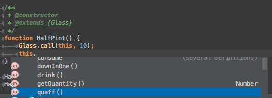
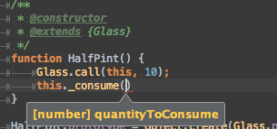
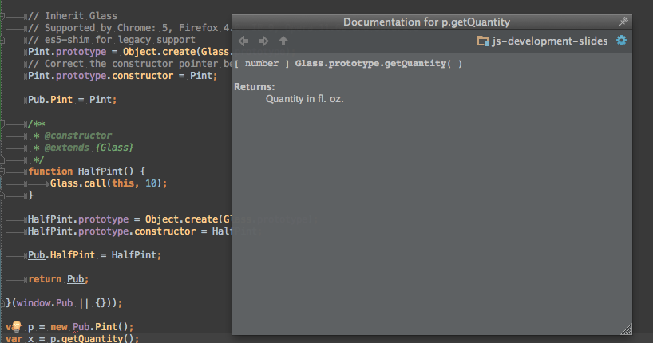
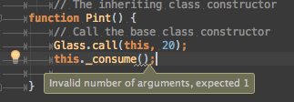

# Object Oriented Javascript

## Marco Bettiolo

marco@bettiolo.it

@bettiolo

http://bettiolo.it

- - -

### Topics

- Back to the past
- Hoisting
- Avoiding pitfalls
- Closures
- Object literal
- Module pattern
- Revealing module pattern
- Classic objects
- Prototypal inheritance
- JsDoc
- CoffeeScript
- TypeScript
- EcmaScript Harmony

- - -

### IE6 style javascript

`pint.js`

```js
var quantity = 20; // Fl. oz.

function consume (quantityToConsume) {
  if (quantity <= 0) {
    return;
  }
  if (quantity > quantityToConsume) {
    quantity -= quantityToConsume;
  } else {
    quantity = 0;
  }
}

function drink() {
  consume(1);
}

function quaff() {
  consume(4);
}

function downInOne() {
  consume(quantity);
}
```


### Requirements change

You need to support half pint size

`halfPint.js`

```js
var quantity = 10; // Fl. oz.

function consume (quantityToConsume) {
  if (quantity <= 0) {
    return;
  }
  if (quantity > quantityToConsume) {
    quantity -= quantityToConsume;
  } else {
    quantity = 0;
  }
}

function drink() {
  consume(1);
}

function quaff() {
  consume(4);
}

function downInOne() {
  consume(quantity);
}
```


### FAIL


Global variables and functions are conflicting each other.

The scope of a variable declared with var is the enclosing function or, 
for variables declared outside a function, the global scope (which is bound to the global object).

Behind the scene, everything has been attached to the `window` object.

Only functions define scope, files or code blocks (like `if`, `for`, `do`, ...) does not.


### Let

Declares a block scope local variable, optionally initializing it to a value.

```js
for (let i = 0; i<10; i++) {
  alert(i); // 1, 2, 3, 4 ... 9
}

alert(i); // i is not defined
```

Supported by IE 11+, FF 11+ and Chrome 19+

- - -

### Hoisting
Variables are automatically hoisted to the beginning of the scope regardless of where
they are defined.

```js
// all the following assignments are the same in the global context
// if running in a closure the behaviour will be different
variable = 20;
var variable = 20;
window.variable = 20;

function outer() {

  function inner() {
    var variable = 10;
    console.log('Inner value is ' + variable); // 10
  }
  inner();

  console.log('Outer value is ' + variable); // undefined
  if (true) {
    var variable = 30;
    console.log('Block value is ' + variable); // 30
  }
  console.log('Final value is ' + variable); // 30
}
outer();
```


### What did javascript do?

```js
window.variable = 20;
window.variable = 20;
window.variable = 20;

function outer() {
  var variable;

  function inner() {
    var variable = 10;
    console.log('Inner is ' + variable); // 10
  }
  inner();

  console.log('First outer is ' + variable); // undefined

  if (true) {
    variable = 30;
    console.log('Block is ' + variable); // 30
  }
  console.log('Final outer is ' + variable); // 30
}
outer();
```

- function-scoped
- hoist to the top of its function
- redeclarations of the same name in the same scope are no-ops

- - -

### Strict mode

`'use strict';` as the first instruction (file or function).

Changes both syntax and runtime behavior.

Makes JS development more sane, for example, accidental definition of global variables throws `ReferenceError`.

- Changes converting mistakes into errors (as syntax errors or at runtime)
- Changes simplifying how the particular variable for a given use of a name is computed,
- Changes simplifying eval and arguments
- Changes making it easier to write "secure" JavaScript
- Changes anticipating future ECMAScript evolution


### Douglas Crockford's one var per function rule

Highly controversial and debated rule supported by `jshint` and `jslint`.
Enforces developers to code in the same way that the code will be executed by
making this behavior explicit.

```js
var i,
    values = this._parameters[key],
    encodedKey = this._rfc3986.encode(key),
    encodedValue;
values.sort();
for (i = 0; i < values.length; i++) {
    encodedValue = this._rfc3986.encode(values[i]);
    this._normalizedParameters.push(encodedKey + '=' + encodedValue)
}
```

Plus makes SRP violation very clear :)


### JsHint

Enforces coding style across project and teams

Store the settings in `.jshintrc`

```json
{
  "bitwise" : true,
  "browser" : true,
  "camelcase" : true,
  "curly" : true,
  "eqeqeq" : true,
  "es3" : false,
  "esnext" : false,
  "forin" : true,
  "indent" : 4,
  "immed" : true,
  "latedef" : true,
  "maxlen" : 120,
  "newcap" : true,
  "noarg" : true,
  "noempty" : true,
  "nonew" : true,
  "onevar" : true,
  "plusplus" : false,
  "quotmark" : "single",
  "regexp" : true,
  "strict" : true,
  "trailing" : true,
  "undef" : true,
  "unused" : true
}
```

Can be automated via grunt to provide constant feedback.

- - -

### Closures

Functions can access parent scopes. Parent function cannot access inner scopes. We can use this rules to structure code and to prevent global object pollution.

```js
function outer() {
  'use strict';
  var outerVariable = 10;

  function inner() {
    outerVariable++;
    var innerVariable = 20;
    console.log('Outer Variable from Inner: ' + outerVariable);
    console.log('Inner Variable from Inner: ' + innerVariable);
  }
  console.log('Outer Variable from Outer: ' + outerVariable);
  console.log('Inner Variable from Outer: ' + (typeof innerVariable));
  return inner;
}
var innerCopy1 = outer();
var innerCopy2 = outer();
// ... later
innerCopy2();
innerCopy2();
innerCopy1();
```


### Closures

A closure is a special kind of object that combines two things: a function, and the environment in which that function was created.
The environment consists of any local variables that were in-scope at the time that the closure was created.


### Closures

Changing the variables in the outer scope of one closure does not affect the other.


- - -

### Object literal

```js
// Immediately-Invoked Function Expression (IIFE)
(function () {
  'use strict';

  window.pint = {
    quantity: 20, // Fl. oz
    consume: function (quantityToConsume) {
      if (this.quantity <= 0) {
        return;
      }
      if (this.quantity > quantityToConsume) {
        this.quantity -= quantityToConsume;
      } else {
        this.quantity = 0;
      }
    },
    drink: function () {
      this.consume(1);
    },
    quaff: function () {
      this.consume(4);
    },
    downInOne: function () {
      this.consume(this.quantity);
    }
  };

})();
```
We can access our object like: `[window.]pint.drink();`


### Object literal

Is a list of zero or more pairs of property names and associated values of an object, enclosed in curly braces ({}).
Numeric or string literal can be used for the name of a property. Objects can be nested.

```js
var unusualPropertyNames = {
  "": "An empty string",
  "!": "Bang!",
  nested: {
    "1": "value-1",
    "2": "value-2"
  }
}
```

Non valid identifier can be accessed with array like notation `unusualPropertyNames["!"] == "Bang!"` 

- - -

### Module pattern

```js
// Pub is our namespace
window.Pub = (function (Pub) {
  'use strict';

  var pint = {}, // module
    _quantity = 0; // private variable

  function fill() { // private method
    _quantity = 20;
  }

  function consume(quantityToConsume) { // private method
    if (_quantity <= 0) {
      return;
    }
    if (_quantity > quantityToConsume) {
      _quantity -= quantityToConsume;
    } else {
      _quantity = 0;
    }
  }

  fill();

  // the following functions capture a copy
  // of the outer function
  pint.drink = function () {
    consume(1);
  };
  pint.quaff = function () {
    consume(4);
  };
  pint.downInOne = function () {
    consume(_quantity);
  };
  pint.getQuantity = function () {
    return _quantity;
  };
  pint.refill = function () {
    fill();
  };

  Pub.pint = pint;
  return Pub;

}(window.Pub || {}));
```
Usage is `[window.]Pub.pint.drink();`


### Module pattern

We can define namespaces by creating nested objects.

JavaScript does not have access modifiers but we can create private code by using closures.

The returned module will define our public API.

- - -

### Revealing module pattern

```js
// Pub is our namespace
window.Pub = (function (Pub) {
  'use strict';

  var _quantity = 0; // private variable

  function fill() { // private method
    _quantity = 20;
  }

  function consume(quantityToConsume) { // private method
    if (_quantity <= 0) {
      return;
    }
    if (_quantity > quantityToConsume) {
      _quantity -= quantityToConsume;
    } else {
      _quantity = 0;
    }
  }

  function drink() {
    consume(1);
  }

  function quaff() {
    consume(4);
  }

  function downInOne() {
    consume(_quantity);
  }

  function getQuantity() {
    return _quantity;
  }

  fill(); // some behaviour

  // we return an object literal that acts as a closure.
  // after returning, the stack-frame is not destroyed (as opposed to C)
  // a copy of the outer function is captured.
  Pub.pint = {
    drink: drink,
    quaff: quaff,
    downInOne: downInOne,
    getQuantity: getQuantity,
    refill: fill
  };

  return Pub;
}(window.Pub || {}));
```
Usage is `[window.]Pub.pint.drink();`


### Revealing module pattern

The code defining the returned public API is very concise.

There is no need to repeat multiple times the name of the class that will be returned.

- - -

### Classic JavaScript objects

```js
// Pub is our namespace
window.Pub = (function (Pub) {
  'use strict';

  function Pint() { // Constructor
    this._quantity = 20; // private by convention
  }

  // private by convention
  Pint.prototype._consume = function (quantityToConsume) {
    if (this._quantity <= 0) {
      return;
    }
    if (this._quantity > quantityToConsume) {
      this._quantity -= quantityToConsume;
    } else {
      this._quantity = 0;
    }
  };

  Pint.prototype.drink = function () {
    this._consume(1);
  };

  Pint.prototype.quaff = function () {
    this._consume(4);
  };

  Pint.prototype.downInOne = function () {
    this._consume(this._quantity);
  };

  Pint.prototype.getQuantity = function () {
    return this._quantity;
  };

  Pub.Pint = Pint;
  return Pub;

}(window.Pub || {}));
```


### Classic JavaScript objects
Usage: 

```js
var pint = new window.Pub.Pint();
pint.drink();
```

The `new` keyword creates a new object that inherits from Pint's prototype. `this` is bound to the newly created object's instance.

There is only one prototype object with a varying context for all the instances. This saves memory and speeds things up compared to the other patterns.

- - -

### Prototypal inheritance

JavaScript's programming model is a class-less, prototype-oriented or instance-based programming.

Prototypes are objects. To achieve inheritance we need to set-up a prototype chain. We can decorate and redefine properties.


### Prototypal inheritance

Pint and HalfPint inherits from 'abstract' Glass

```js
window.Pub = (function (Pub) {
  'use strict';

  function Glass(quantity) { // Base class constructor
    this._quantity = quantity; // Private by convention
  };

  // Private by convention
  Glass.prototype._consume = function (quantityToConsume) {
    if (this._quantity <= 0) {
      return;
    }
    if (this._quantity > quantityToConsume) {
      this._quantity -= quantityToConsume;
    } else {
      this._quantity = 0;
    }
  };

  Glass.prototype.drink = function () {
    this._consume(1);
  };

  Glass.prototype.quaff = function () {
    this._consume(4);
  };

  Glass.prototype.downInOne = function () {
    this._consume(this._quantity);
  };

  Glass.prototype.getQuantity = function () {
    return this._quantity;
  };

  Pub.Glass = Glass;

  // The specialized class constructor
  function Pint() {
    // Call the base class constructor
    Glass.call(this, 20);
  }

  Pint.prototype = Object.create(Glass.prototype);
  // Correct the constructor pointer because it points to Glass
  Pint.prototype.constructor = Pint;

  Pub.Pint = Pint;

  function HalfPint() {
    Glass.call(this, 10);
  }

  HalfPint.prototype = Object.create(Glass.prototype);
  HalfPint.prototype.constructor = HalfPint;

  Pub.HalfPint = HalfPint;
  
  return Pub;

}(window.Pub || {}));
```


### Prototypal inheritance

Usage: 

```js
var pint = new window.Pub.Pint();
pint.drink();

pint instanceof window.Pub.Pint // TRUE
pint instanceof window.Pub.Glass // TRUE
pint instanceof window.Pub.HalfPint // FALSE
pint instanceof Object // TRUE
```

JavaScript will go up the prototype chain to find the `drink()` method.
First, it will look on Pint object's prototype. Then it will look on Glass and find the method.

`instanceof` will check that the instance's proptotype match, if not will go up the prototype chain to Object.

- - -

### JsDoc

Documents JavaScript and enriches editor's intellisense
Supported by editors like WebStorm, Sublime Text and others

```js
window.Pub2 = (function (Pub) {
  'use strict';

  /**
   * @constructor
   * @param {number} quantity The quantity of liquid in the glass in fl. oz.
   * @abstract
   */
  var Glass = function (quantity) {
    /** @private */
    this._quantity = quantity;
  };

  /**
   * @param {number} quantityToConsume How much liquid to consumed in fl. oz.
   * @private
   */
  Glass.prototype._consume = function (quantityToConsume) {
    if (this._quantity <= 0) {
      return;
    }
    if (this._quantity > quantityToConsume) {
      this._quantity -= quantityToConsume;
    } else {
      this._quantity = 0;
    }
  };

  Glass.prototype.drink = function () {
    this._consume(1);
  };

  Glass.prototype.quaff = function () {
    this._consume(4);
  };

  Glass.prototype.downInOne = function () {
    this._consume(this._quantity);
  };

  /** @returns {number} Quantity in fl. oz. */
  Glass.prototype.getQuantity = function () {
    return this._quantity;
  };

  /**
   * @constructor
   * @extends {Glass}
   */
  function Pint() {
    Glass.call(this, 20);
  }

  Pint.prototype = Object.create(Glass.prototype);
  Pint.prototype.constructor = Pint;

  Pub.Pint = Pint;

  /**
   * @constructor
   * --@extends {Glass}
   */
  function HalfPint() {
    Glass.call(this, 10);
  }

  HalfPint.prototype = Object.create(Glass.prototype);
  HalfPint.prototype.constructor = HalfPint;

  Pub.HalfPint = HalfPint;

  return Pub;

}(window.Pub2 || {}));
```


### JsDoc

Intellisense



Parameter help




### JsDoc

Documentation




### JsDoc

Parameter checking



- - -

### CoffeeScript

```coffeescript
window.Pub = ((Pub) ->

  class Glass
    constructor: (quantity) ->
      @_quantity = quantity # Instance field private by convention

    _consume: (quantityToConsume) ->
      return if @_quantity <= 0
      if (@_quantity > quantityToConsume)
        @_quantity -= quantityToConsume
      else
        @_quantity = 0

    drink: () ->
      @_consume(1)

    quaff: () ->
      @_consume(4)

    downInOne: () ->
      @_consume(@_quantity)

    getQuantity: () ->
      return @_quantity

  class Pint extends Glass
    constructor: () ->
      super(20)

  Pub.Pint = Pint

  class HalfPint extends Glass
    constructor: () ->
      super(10)

  Pub.HalfPint = HalfPint

  return Pub
)(window.Pub or {})
```

- - - 

### TypeScript

```typescript
window.Pub = ((Pub) ->

  class Glass
    constructor: (quantity) ->
      @_quantity = quantity # Instance field private by convention

    _consume: (quantityToConsume) ->
      return if @_quantity <= 0
      if (@_quantity > quantityToConsume)
        @_quantity -= quantityToConsume
      else
        @_quantity = 0

    drink: () ->
      @_consume(1)

    quaff: () ->
      @_consume(4)

    downInOne: () ->
      @_consume(@_quantity)

    getQuantity: () ->
      return @_quantity

  class Pint extends Glass
    constructor: () ->
      super(20)

  Pub.Pint = Pint

  class HalfPint extends Glass
    constructor: () ->
      super(10)

  Pub.HalfPint = HalfPint

  return Pub
)(window.Pub or {})
```

- - -

### EcmaScript Harmony

```js
window.Pub = (function (Pub) {
  'use strict';

  class Glass {
    constructor(quantity) {
      this._quantity = quantity;
    }

    _consume(quantityToConsume) {
      if (this._quantity <= 0) {
        return;
      }
      if (this._quantity > quantityToConsume) {
        this._quantity -= quantityToConsume;
      } else {
        this._quantity = 0;
      }
    }

    drink() {
      this._consume(1);
    }

    quaff() {
      this._consume(4);
    }

    downInOne() {
      this._consume(this._quantity);
    }

    getQuantity() {
      return this._quantity;
    }

  }

  class Pint extends Glass {
    constructor() {
      super(20);
    }
  }

  Pub.Pint = Pint;

  class HalfPint extends Glass {
    constructor() {
      super(10);
    }
  }

  Pub.HalfPint = HalfPint;

  return Pub;

}(window.Pub || {}));
```

A long way to go but can be transpiled with Google Traceur

- - - 

### Other tools
- CommonJs
- AMD with RequireJS
- jQuery
- [...]

- - -

# Questions?

marco@bettiolo.it

@bettiolo

http://bettiolo.it