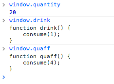
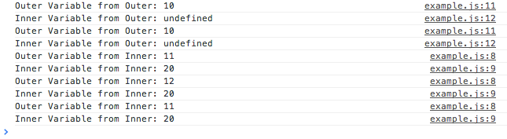
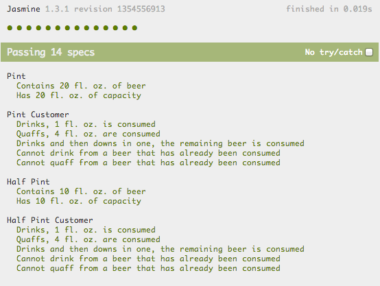

# Object Oriented Javascript

### Marco Bettiolo
- marco@bettiolo.it
- @bettiolo
- bettiolo.it

- - -

## Topics

- [Scope & conflicts](#/scope)
- Hoisting
- Let keyword
- Object literals
- Module pattern
- Objects
- Prototypal inheritance
- Parent object access
- JsDoc
- CoffeeScript
- TypeScript
- EcmaScript Harmony

- - -

### IE6 style javascript

`pint.js`

```js
var quantity = 20; // Fl. oz.

function consume (quantityToConsume) {
  if (quantity <= 0) {
    return;
  }
  if (quantity > quantityToConsume) {
    quantity -= quantityToConsume;
  } else {
    quantity = 0;
  }
}

function drink() {
  consume(1);
}

function quaff() {
  consume(4);
}

function downInOne() {
  consume(quantity);
}
```


### Requirements change

You need to support half pint size

`halfPint.js`

```js
var quantity = 10; // Fl. oz.

function consume (quantityToConsume) {
  if (quantity <= 0) {
    return;
  }
  if (quantity > quantityToConsume) {
    quantity -= quantityToConsume;
  } else {
    quantity = 0;
  }
}

function drink() {
  consume(1);
}

function quaff() {
  consume(4);
}

function downInOne() {
  consume(quantity);
}
```


### FAIL



Global variables and functions are conflicting each other.

The scope of a variable declared with var is the enclosing function or, 
for variables declared outside a function, the global scope (which is bound to the global object).

Behind the scene, everything has been attached to the `window` object.

Only functions define scope, files or code blocks (like `if`, `for`, `do`, ...) does not.


### Let

Declares a block scope local variable, optionally initializing it to a value.

```js
for (let i = 0; i<10; i++) {
  alert(i); // 1, 2, 3, 4 ... 9
}

alert(i); // i is not defined
```

Supported by IE 11+, FF 11+ and Chrome 19+ and available in EcmaScript 6

- - -

### Hoisting
Variables are automatically hoisted to the beginning of the scope regardless of where
they are defined.

```js
// all the following assignments are the same in the global context
// if running in a closure the behaviour will be different
variable = 20;
var variable = 20;
window.variable = 20;

function outer() {

  function inner() {
    var variable = 10;
    console.log('Inner value is ' + variable); // 10
  }
  inner();

  console.log('Outer value is ' + variable); // undefined
  if (true) {
    var variable = 30;
    console.log('Block value is ' + variable); // 30
  }
  console.log('Final value is ' + variable); // 30
}
outer();
```


### What did javascript do?

```js
window.variable = 20;
window.variable = 20;
window.variable = 20;

function outer() {
  var variable;

  function inner() {
    var variable = 10;
    console.log('Inner is ' + variable); // 10
  }
  inner();

  console.log('First outer is ' + variable); // undefined

  if (true) {
    variable = 30;
    console.log('Block is ' + variable); // 30
  }
  console.log('Final outer is ' + variable); // 30
}
outer();
```

- function-scoped
- hoist to the top of its function
- redeclarations of the same name in the same scope are no-ops

- - -

### Strict mode

`'use strict';` as the first instruction (file or function).

Changes both syntax and runtime behavior.

Makes JS development more sane, for example, accidental definition of global variables throws `ReferenceError`.

- Changes converting mistakes into errors (as syntax errors or at runtime)
- Changes simplifying how the particular variable for a given use of a name is computed,
- Changes simplifying eval and arguments
- Changes making it easier to write "secure" JavaScript
- Changes anticipating future ECMAScript evolution


### Douglas Crackford's one var per function rule

Highly controversial and debated rule supported by `jshint` and `jslint`.
Enforces developers to code in the same way that the code will be executed by
making this behavior explicit. Love or hate?

```js
var i,
    values = this._parameters[key],
    encodedKey = this._rfc3986.encode(key),
    encodedValue;
values.sort();
for (i = 0; i < values.length; i++) {
    encodedValue = this._rfc3986.encode(values[i]);
    this._normalizedParameters.push(encodedKey + '=' + encodedValue)
}
```

Plus makes SRP violation very clear :)

- - -

### JsHint

Enforces coding style across project and teams

Store the settings in `.jshintrc` file in the root of your project

```json
{
  "bitwise" : true,
  "browser" : true,
  "camelcase" : true,
  "curly" : true,
  "eqeqeq" : true,
  "es3" : false,
  "esnext" : false,
  "forin" : true,
  "indent" : 4,
  "immed" : true,
  "latedef" : true,
  "maxlen" : 120,
  "newcap" : true,
  "noarg" : true,
  "noempty" : true,
  "nonew" : true,
  "onevar" : true,
  "plusplus" : false,
  "quotmark" : "single",
  "regexp" : true,
  "strict" : true,
  "trailing" : true,
  "undef" : true,
  "unused" : true
}
```

`npm install -g jshint`

`jshint filename.js`

- - -

### Closures

Functions can access parent scopes.

```js
function outer() {
  'use strict';
  var outerVariable = 10;

  function inner() {
    outerVariable++;
    var innerVariable = 20;
    console.log('Outer Variable from Inner: ' + outerVariable);
    console.log('Inner Variable from Inner: ' + innerVariable);
  }
  console.log('Outer Variable from Outer: ' + outerVariable);
  console.log('Inner Variable from Outer: ' + (typeof innerVariable));
  return inner;
}
var innerCopy1 = outer();
var innerCopy2 = outer();
// ... later
innerCopy2();
innerCopy2();
innerCopy1();
```


### Closures

A closure is a special kind of object that combines two things: a function, and the environment in which that function was created.
The environment consists of any local variables that were in-scope at the time that the closure was created.


### Closures

Changing the variables in the outer scope of one closure does not affect the other.



- - -

### Object literal

- - -

### Module pattern

- - -

### Revealing module pattern

- - -

### Classic JavaScript objects

- - -

### Prototypal Inheritance

We have too much duplicated logic.

- JavaScript is a prototypal language, the `prototype` property is available on each function

- We can use the `prototype` to scaffold a class and a constructor to create an instance

- We can also inherit anoter object's `prototype`

- - -

### Prototypal Inheritance

Pint and HalfPint inherits from 'abstract' Glass

```js
var Glass = function () { // This will be our base class
  'use strict';

  function Glass(capacity) {
    this.quantity = 0; // Instance property
    this.capacity = capacity; // Instance property
  }

  // Ensure the constructor is correct
  Glass.prototype.constructor = Glass;

  Glass.prototype.consume = function (consumedQuantity) {
    if (this.quantity > 0) {
      this.quantity -= consumedQuantity;
    }
  };

  Glass.prototype.drink = function () {
    this.consume(1);
  };

  Glass.prototype.quaff = function () {
    this.consume(4);
  };

  Glass.prototype.downInOne = function () {
    this.consume(this.quantity);
  };

  // Return the constructor
  return Glass;

}(); // Immediately-Invoked Function Expression (IIFE)

var Pint = function () {
  'use strict';

  function Pint() {
    Glass.call(this, 20); // Pint size in fl. oz.
    this.quantity = 20; // Pint size in fl. oz.
  }

  // Inherit the base class, available in ES5
  Pint.prototype = Object.create(Glass.prototype);

  // Ensure the constructor is correct
  Pint.prototype.constructor = Pint;

  return Pint;
}();

var HalfPint = function () {
  'use strict';

  function HalfPint() {
    Glass.call(this, 10); // Half Pint size in fl. oz.
    this.quantity = 10; // Half Pint size in fl. oz.
  }

  HalfPint.prototype = Object.create(Glass.prototype);

  HalfPint.prototype.constructor = HalfPint;

  return HalfPint;
}();
```


Let's update the tests to use the `new` keyword

We can now access the 'public' methods and properties of the base class

```js
describe('Pint', function () {
  'use strict';
  
  var pint;

  beforeEach(function () {
    pint = new Pint();
  });

  it('Contains 20 fl. oz. of beer', function () {
    expect(pint.quantity).toEqual(20);
  });

  it('Has 20 fl. oz. of capacity', function () {
    expect(pint.capacity).toEqual(20);
  });
});

describe('Pint Customer', function () {
  'use strict';
  
  var pint;

  beforeEach(function () {
    pint = new Pint();
  });

  it('Drinks, 1 fl. oz. is consumed', function () {
    pint.drink();
    expect(pint.quantity).toEqual(19);
  });

  it('Quaffs, 4 fl. oz. are consumed', function () {
    pint.quaff();
    expect(pint.quantity).toEqual(16);
  });

  it('Drinks and then downs in one, the remaining beer is consumed', function () {
    pint.drink();
    pint.downInOne();
    expect(pint.quantity).toEqual(0);
  });

  it('Cannot drink from a beer that has already been consumed', function () {
    pint.downInOne();
    pint.drink();
    expect(pint.quantity).toEqual(0);
  });

  it('Cannot quaff from a beer that has already been consumed', function () {
    pint.downInOne();
    pint.quaff();
    expect(pint.quantity).toEqual(0);
  });

});
```


Results



- - -

### JsDoc3

documents JavaScript and enriches editor's intellisense

supported by editors like WebStorm, Sublime Text and others

## SCREENSHOTS [...]

- - -

### Other tools
- CommonJs
- AMD with RequireJs
- jQuery
- [...]

# Questions?
