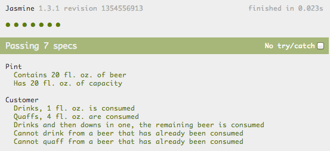
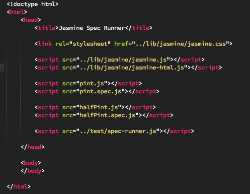
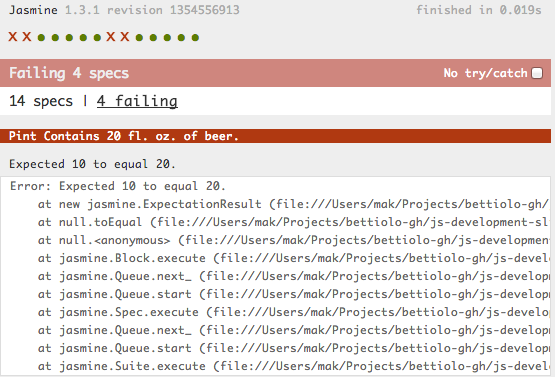
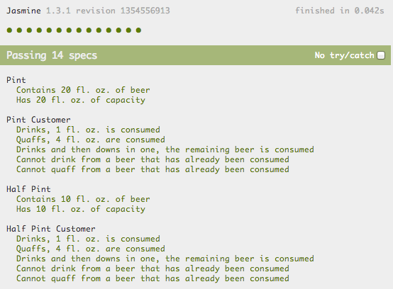
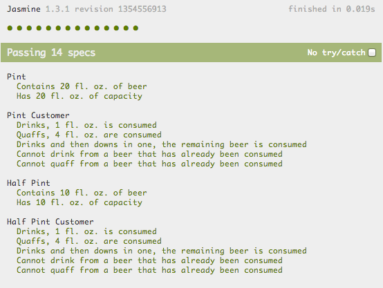
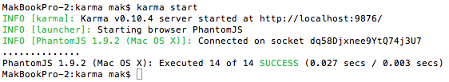

## Object Oriented, Test Driven Javascript + Packaging

&nbsp;

&nbsp;

Marco Bettiolo

[github.com/bettiolo](http://github.com/bettiolo)

- - -

### Jasmine

TDD with [Jasmine](http://pivotal.github.io/jasmine/) spec runner

_(demo)_

- - -

### IE6 style javascript

`pint.js`

```js
var capacity = 20; // Fl. oz.
var quantity = 20; // Fl. oz.

function consume (consumedQuantity) {
  if (quantity > 0) {
    quantity -= consumedQuantity;
  }
}

function drink() {
  consume(1);
}

function quaff() {
  consume(4);
}

function downInOne() {
  consume(quantity);
}
```

... so 2001

- - -

### But we are in 2013!
### Where are the tests?

`pint.spec.js` using Jasmine

```js
describe('Pint', function () {
  'use strict';

  it('Contains 20 fl. oz. of beer', function () {
    expect(quantity).toEqual(20);
  });

  it('Has 20 fl. oz. of capacity', function () {
    expect(capacity).toEqual(20);
  });
});

describe('Pint Customer', function () {
  'use strict';

  beforeEach(function () {
    quantity = 20;
    capacity = 20;
  });

  it('Drinks, 1 fl. oz. is consumed', function () {
    drink();
    expect(quantity).toEqual(19);
  });

  it('Quaffs, 4 fl. oz. are consumed', function () {
    quaff();
    expect(quantity).toEqual(16);
  });

  it('Drinks and then downs in one, the remaining beer is consumed', function () {
    drink();
    downInOne();
    expect(quantity).toEqual(0);
  });

  it('Cannot drink from a beer that has already been consumed', function () {
    downInOne();
    drink();
    expect(quantity).toEqual(0);
  });

  it('Cannot quaff from a beer that has already been consumed', function () {
    downInOne();
    quaff();
    expect(quantity).toEqual(0);
  });

});
```


Spec runner


Results



- - -

### Requirements change

You need to support half pint size

`halfPint.js`

```js
var capacity = 10; // Fl. oz.
var quantity = 10; // Fl. oz.

function consume (consumedQuantity) {
  if (quantity > 0) {
    quantity -= consumedQuantity;
  }
}

function drink() {
  consume(1);
}

function quaff() {
  consume(4);
}

function downInOne() {
  consume(quantity);
}
```


Write the tests inside `halfPint.spec.js`, 

update the spec runner



and ... 


## FAIL

Globals are conflicting because everything is running in the same `window` scope



Should we rename the variables? Will eventually break.

- - -

### Module pattern to the resque

Functions define scope (if, for, do, ... not!)

`pint.js`

```js
function createPint() { // Constructor
  var capacity = 20; // Private
  var quantity = 20; // Private

  function consume (consumedQuantity) { // Private
    if (quantity > 0) {
      quantity -= consumedQuantity;
    }
  }

  return {
    getCapacity : function () {
      return capacity; // Read Only
    },
    getQuantity : function () {
      return quantity; // Read Only
    },
    drink : function () {
      consume(1); 
    },
    quaff : function () {
      consume(4);
    },
    downInOne : function () {
      consume(quantity);
    }
  };
}
```
repeat for `halfPint.js`


We quickly update the tests to use the 'constructor'

`pint.spec.js`

```js
describe('Pint', function () {
  'use strict';
  
  var pint;

  beforeEach(function () {
    pint = createPint();
  });

  it('Contains 20 fl. oz. of beer', function () {
    expect(pint.getQuantity()).toEqual(20);
  });

  it('Has 20 fl. oz. of capacity', function () {
    expect(pint.getCapacity()).toEqual(20);
  });
});

describe('Pint Customer', function () {
  'use strict';
  
  var pint;

  beforeEach(function () {
    pint = createPint();
  });

  it('Drinks, 1 fl. oz. is consumed', function () {
    pint.drink();
    expect(pint.getQuantity()).toEqual(19);
  });

  it('Quaffs, 4 fl. oz. are consumed', function () {
    pint.quaff();
    expect(pint.getQuantity()).toEqual(16);
  });

  it('Drinks and then downs in one, the remaining beer is consumed', function () {
    pint.drink();
    pint.downInOne();
    expect(pint.getQuantity()).toEqual(0);
  });

  it('Cannot drink from a beer that has already been consumed', function () {
    pint.downInOne();
    pint.drink();
    expect(pint.getQuantity()).toEqual(0);
  });

  it('Cannot quaff from a beer that has already been consumed', function () {
    pint.downInOne();
    pint.quaff();
    expect(pint.getQuantity()).toEqual(0);
  });

});
```
and we update `halfPint.spec.js` as well ...


Results



- - -

### Tool break!

[EditorConfig](http://editorconfig.org/) enforces coding style across different editors

```
# editorconfig.org
root = true

[*]
indent_style = tab
indent_size = 4
tab_width = 4
end_of_line = lf
charset = utf-8
trim_trailing_whitespace = true
insert_final_newline = true

[*.{md,html,htm,html,json,yml}]
indent_style = tab
indent_size = 2
[.jshintrc]
indent_style = tab
indent_size = 2
```

_(demo)_

- - -

## Inheritance

We have too much duplicated logic.

- JavaScript is a prototypal language, the `prototype` property is available on each function

- We can use the `prototype` to scaffold a class and a constructor to create an instance

- We can also inherit anoter object's `prototype`

- - -

## Inheritance

Let's pretend Pint and HalfPint inherits from 'abstract' Glass

```js
var Glass = function () { // This will be our base class
  'use strict';

  function Glass(capacity) {
    this.quantity = 0; // Instance property
    this.capacity = capacity; // Instance property
  }

  // Ensure the constructor is correct
  Glass.prototype.constructor = Glass;

  Glass.prototype.consume = function (consumedQuantity) {
    if (this.quantity > 0) {
      this.quantity -= consumedQuantity;
    }
  };

  Glass.prototype.drink = function () {
    this.consume(1);  
  };

  Glass.prototype.quaff = function () {
    this.consume(4);
  };

  Glass.prototype.downInOne = function () {
    this.consume(this.quantity);
  };

  // Return the constructor
  return Glass;

}(); // Immediately-Invoked Function Expression (IIFE)

var Pint = function () {
  'use strict';

  function Pint() {
    Glass.call(this, 20); // Pint size in fl. oz.
    this.quantity = 20; // Pint size in fl. oz.
  }

  // Inherit the base class, available in ES5
  Pint.prototype = Object.create(Glass.prototype);

  // Ensure the constructor is correct
  Pint.prototype.constructor = Pint;

  return Pint;
}();

var HalfPint = function () {
  'use strict';

  function HalfPint() {
    Glass.call(this, 10); // Half Pint size in fl. oz.
    this.quantity = 10; // Half Pint size in fl. oz.
  }

  HalfPint.prototype = Object.create(Glass.prototype);

  HalfPint.prototype.constructor = HalfPint;

  return HalfPint;
}();
```


Let's update the tests to use the `new` keyword

We can now access the 'public' methods and properties of the base class

```js
describe('Pint', function () {
  'use strict';
  
  var pint;

  beforeEach(function () {
    pint = new Pint();
  });

  it('Contains 20 fl. oz. of beer', function () {
    expect(pint.quantity).toEqual(20);
  });

  it('Has 20 fl. oz. of capacity', function () {
    expect(pint.capacity).toEqual(20);
  });
});

describe('Pint Customer', function () {
  'use strict';
  
  var pint;

  beforeEach(function () {
    pint = new Pint();
  });

  it('Drinks, 1 fl. oz. is consumed', function () {
    pint.drink();
    expect(pint.quantity).toEqual(19);
  });

  it('Quaffs, 4 fl. oz. are consumed', function () {
    pint.quaff();
    expect(pint.quantity).toEqual(16);
  });

  it('Drinks and then downs in one, the remaining beer is consumed', function () {
    pint.drink();
    pint.downInOne();
    expect(pint.quantity).toEqual(0);
  });

  it('Cannot drink from a beer that has already been consumed', function () {
    pint.downInOne();
    pint.drink();
    expect(pint.quantity).toEqual(0);
  });

  it('Cannot quaff from a beer that has already been consumed', function () {
    pint.downInOne();
    pint.quaff();
    expect(pint.quantity).toEqual(0);
  });

});
```


Results



- - -

## I want more TOOLS!!!11!

- JsHint
- JsDoc
- Karma + PhantomJs
- Travis-CI
- RequireJs
- Grunt

- - -

## JsHint

`.jshintrc` to enforce coding style

```json
{
  "bitwise" : true,
  "browser" : true,
  "camelcase" : true,
  "curly" : true,
  "eqeqeq" : true,
  "es3" : false,
  "esnext" : false,
  "forin" : true,
  "indent" : 4,
  "immed" : true,
  "latedef" : true,
  "maxlen" : 120,
  "newcap" : true,
  "noarg" : true,
  "noempty" : true,
  "nonew" : true,
  "onevar" : true,
  "plusplus" : false,
  "quotmark" : "single",
  "regexp" : true,
  "strict" : true,
  "trailing" : true,
  "undef" : true,
  "unused" : true
}
```

`npm install -g jshint`

`jshint filename.js` _(demo)_

- - -

## JsDoc3

for documenting JavaScript and enriching editor intellisense

```js
var Glass = function () {
  'use strict';

  /**
   * @constructor
   * @param {number} capacity The capacity of the glass in oz.
   * @abstract
   */
  function Glass(capacity) {
    this.quantity = 0; // Instance property
    this.capacity = capacity; // Instance property
  }

  // Ensure the constructor is correct
  Glass.prototype.constructor = Glass;

  /** @param {number} consumedQuantity How much has been consumed in oz. */
  Glass.prototype.consume = function (consumedQuantity) {
    if (this.quantity > 0) {
      this.quantity -= consumedQuantity;
    }
  };

  Glass.prototype.drink = function () {
    this.consume(1);
  };

  Glass.prototype.quaff = function () {
    this.consume(4);
  };

  Glass.prototype.downInOne = function () {
    this.consume(this.quantity);
  };

  // Return the constructor
  return Glass;

}(); // Immediately-Invoked Function Expression (IIFE)

var Pint = function () {
  'use strict';

  /**
   * @constructor
   * @extends {Glass}
   */
  function Pint() {
    Glass.call(this, 20); // Pint size in fl. oz.
    this.quantity = 20; // Pint size in fl. oz.
  }

  // Inherit the base class
  Pint.prototype = Object.create(Glass.prototype);

  // Ensure the constructor is correct
  Pint.prototype.constructor = Pint;

  return Pint;
}();

var HalfPint = function () {
  'use strict';

  /**
   * @constructor
   * @extends {Glass}
   */
  function HalfPint() {
    Glass.call(this, 10); // Half Pint size in fl. oz.
    this.quantity = 10; // Half Pint size in fl. oz.
  }

  HalfPint.prototype = Object.create(Glass.prototype);

  HalfPint.prototype.constructor = HalfPint;

  return HalfPint;
}();
```

_(demo)_

- - -

## Karma + PhantomJs

`karma.conf.js` Headless test running

```js
module.exports = function (config) {
  'use strict';

  config.set({
    basePath : '',
    frameworks : ['jasmine'],
    files : [
      'inheritance.js',
      '*.spec.js'
    ],
    exclude : [

    ],
    reporters : ['dots'],
    port : 9876,
    colors : true,
    logLevel : config.LOG_INFO,
    autoWatch : false,
    browsers : ['PhantomJS'],
    captureTimeout : 60000,
    singleRun : true
  });
};
```

- `npm install -g karma`
- `karma start`


Results



- single run
- watch

_(demo)_

- - -

## Travis-CI

`.travis.yml` continuous integration for js + github

```yml
language: node_js
node_js:
  - 0.10
```

`package.json`

```json
{
  "name": "package-name",
  "author": "Marco Bettiolo <marco@bettiolo.it>",
  "version": "0.0.1",
  "devDependencies": {
    "karma": "~0.10.4",
    "karma-script-launcher": "~0.1.0",
    "karma-chrome-launcher": "~0.1.0",
    "karma-firefox-launcher": "~0.1.0",
    "karma-html2js-preprocessor": "~0.1.0",
    "karma-jasmine": "~0.1.3",
    "karma-requirejs": "~0.1.0",
    "karma-coffee-preprocessor": "~0.1.0",
    "karma-phantomjs-launcher": "~0.1.0",
    "grunt-karma": "~0.6.2"
  },
  "engines": {
    "node": "~0.10"
  },
  "scripts": {
    "test": "karma start"
  }
}
```

- - -

## RequireJs

Develop using Asynchronous Module Definition

```js
define('glass', [], funcition () {
  function Glass(capacity) {
    // ...
  }
  return Glass;
});

define('pint', [ 'glass' ], function (Glass) {
  function Pint() {
    Glass.call(this, 20);
    this.quantity = 20;
  }
  Pint.prototype = Object.create(Glass.prototype);
  Pint.prototype.constructor = Pint;
  return Pint;
});

require('pint', function (Pint)) {
  // do something with Pint
};
```

RequireJs can optimize a single file bundle

_(demo)_

- - -

## Grunt

Automates repetitive tasks

- Bundles application and inlines almond.js

- Concatenates js files

- Cleans files and folders

- Validates javascript files

- Minifies application and generates source maps

- Watches for file changes and triggers LiveReload

- Runs tests

- ... Many more

_(demo)_

- - -

# Questions?

Code + docs: [github.com/bettiolo/js-development](https://github.com/bettiolo/js-development)